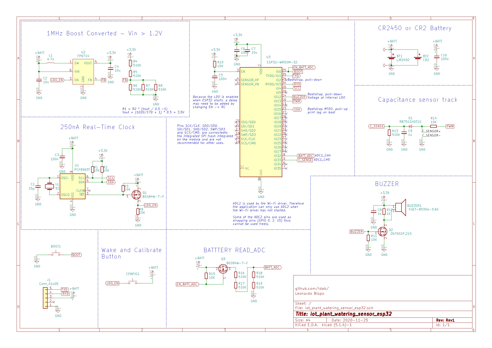

# iot_plant_watering_sensor_esp32
Connected, IoT, WiFi capacitance plant watering sensor based on ESP32

[](https://github.com/ldab/iot_plant_watering_sensor_esp32/releases/latest)
[](https://travis-ci.com/github/ldab/iot_plant_watering_sensor_esp)
[](https://github.com/ldab/iot_plant_watering_sensor_esp32/blob/master/LICENSE)

[](https://github.com/ldab/iot_plant_watering_sensor_esp32)

 ## TODO

- [ ] Check if `esp_light_sleep_start()` improves current vs `delay(x)`
- [ ] Inspect connection time if BSSID is saved vs Saving time
- [ ] FFAT vs SPIFFS time

## VOID

"Lorem ipsum dolor sit amet, consectetur adipiscing elit, sed do eiusmod tempor incididunt ut labore et dolore magna aliqua. Ut enim ad minim veniam, quis nostrud exercitation ullamco laboris nisi ut aliquip ex ea commodo consequat. Duis aute irure dolor in reprehenderit in voluptate velit esse cillum dolore eu fugiat nulla pariatur. Excepteur sint occaecat cupidatat non proident, sunt in culpa qui officia deserunt mollit anim id est laborum."

## PSEUDO-CODE

```
main()
{ 
  turn radio OFF;
  config pins;

  read RTC();

  if( dateIsNotSet )    // probably first time
  {
    beep 2x;
    connect to the internet;
    set date;
    config RTC;
  }

  read moisture;

  if( alarmIsNotActive ) // wake from button
  {
    beep 5x;
    set new moisture level;
    clear alarm flag;    // aka sleep
  }
  else
  {
    if( moisture < threshould)
    {
      connect to the internet;
      send email/MQTT;
      turn radio OFF;

      while( times )
      {
        chrip
      }

      wake 
      clear alarm flag;    // aka sleep
    }
    else
    {
      clear alarm flag;    // aka sleep
    }
  }

  printf should never get here
} 
```

## Power Profile

## Calibrating ADC for ESP32

* ADC on ESP32 has been reported being innacurate, therefore one can use ```adc2_vref_to_gpio( GPIO_NUM_4 );``` to route `Vref` to `GPIO_NUM_4` that can be measured over `SCL -> Rx` in order to calibrate during ADC measurement.
* Calling for `esp_adc_cal_characterize(ADC_UNIT_1, ADC_ATTEN_DB_6, ADC_WIDTH_BIT_11, Vref, adc_chars);`

https://docs.espressif.com/projects/esp-idf/zh_CN/latest/esp32/api-reference/peripherals/adc.html

## Schematic

 

## PCB

 

## Known Limitations

* 

## Credits

Github Shields and Badges created with [Shields.io](https://github.com/badges/shields/)

Inspired by [chirp! - the plant watering alarm](https://wemakethings.net/chirp/)