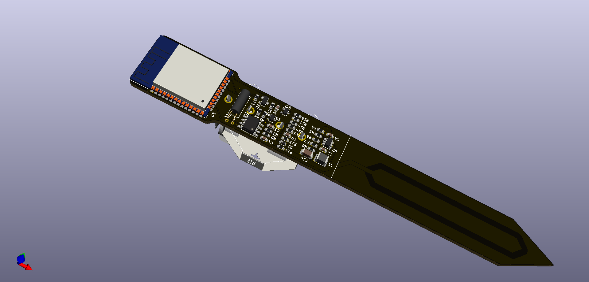
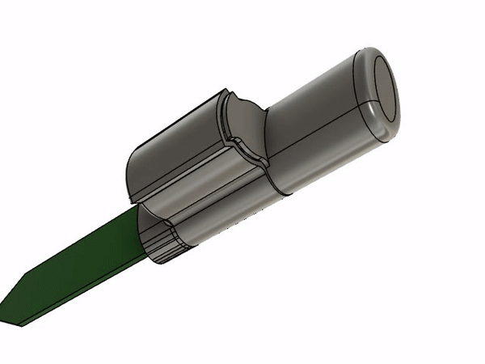

# iot_plant_watering_sensor_esp32
Connected, IoT, WiFi capacitance plant watering sensor based on ESP32

[](https://github.com/ldab/iot_plant_watering_sensor_esp32/releases/latest)
[](https://travis-ci.com/github/ldab/iot_plant_watering_sensor_esp32)
[](https://github.com/ldab/iot_plant_watering_sensor_esp32/blob/master/LICENSE)

[](https://github.com/ldab/iot_plant_watering_sensor_esp32)

 ## TODO

- [ ] Better battery polarity indication and reverse polarity protection;
- [ ] Fix R16 - R19 Silk
- [ ] R15 is leaking 200uA
- [ ] Check if `esp_light_sleep_start()` improves current vs `delay(x)`
- [ ] Inspect connection time if BSSID is saved vs Saving time
- [ ] FOTA
- [ ] Error reporting and callbacks, i.e FFAT, ADC read, etc..

## VOID

"Lorem ipsum dolor sit amet, consectetur adipiscing elit, sed do eiusmod tempor incididunt ut labore et dolore magna aliqua. Ut enim ad minim veniam, quis nostrud exercitation ullamco laboris nisi ut aliquip ex ea commodo consequat. Duis aute irure dolor in reprehenderit in voluptate velit esse cillum dolore eu fugiat nulla pariatur. Excepteur sint occaecat cupidatat non proident, sunt in culpa qui officia deserunt mollit anim id est laborum."

## Working modes and button

* The device will check the moisture 2x a day, at 8am and 6pm;
* On Sundays it will connect to the internet and check time, etc;
* Insert the battery **WATCH THE POLAITY**;
* Press and hold the `config` button;
  * keep it pressed, it will connect to the internet, get the time and date and calibrate the sensor;
  * if everything goes well, it buzzes like this [link for audio]()
* If the battery voltage is lower than 2V, an `email` will be sent and it buzzes like this [link for audio](./ringtones/urgent.mid)
* If the soil is drier than the setpoint, an `email` will be sent and it buzzes like this [link for audio]()
* If a new level of alarm is nedded, press and hold the config button until a buzz like this [link for audio]() is heard;

## Component selection and Capacitive probe

* We need the most range on the voltage across the probe as possible, considering
    
    
**`Vc = 3 * (1 - e(-t / (R * C)))`**

* Varying R from 100 to 15000 Ω @ 1MHz:


[Wolfram Alpha - R Graph](https://www.wolframalpha.com/input/?i=plot+3+*+%281+-+e%5E%28-500*10%5E-9%2F%28R*50*10%5E-12%29%29%29+-+3+*+%281+-+e%5E%28-500*10%5E-9%2F%28R*200*10%5E-12%29%29%29%2C+R%3D+100+to+15000)

* From the graph below we go with 5KΩ, the capacitance of the probe varies from 50pF to 200pF:


[Wolfram Alpha - C Graph](https://www.wolframalpha.com/input/?i=plot+3+*+%281+-+e%5E%28-500*10%5E-9%2F%285000*C%29%29%29%2C+C%3D50*10%5E-12+to+200*10%5E-12)

* With a voltage range of 2.6 to 1.2 **~1.4V**.

## Capacitive sensor measurement

* When in the air, the sensor measures ~2.67V @ 1666(adc)

.BMP)

* And below 1000 (adc) ~1.8V when wet soil/water

.BMP)

## PSEUDO-CODE

```
main()
{ 
  turn radio OFF;
  config pins;

  read RTC();

  if( dateIsNotSet )    // probably first time
  {
    beep 2x;
    connect to the internet;
    set date;
    config RTC;
  }

  read moisture;

  if( alarmIsNotActive ) // wake from button
  {
    beep 5x;
    set new moisture level;
    clear alarm flag;    // aka sleep
  }
  else
  {
    if( moisture < threshould)
    {
      connect to the internet;
      send email/MQTT;
      turn radio OFF;

      while( times )
      {
        chrip
      }

      wake 
      clear alarm flag;    // aka sleep
    }
    else
    {
      clear alarm flag;    // aka sleep
    }
  }

  printf should never get here
} 
```

## Power Profile

## Calibrating ADC for ESP32

* ADC on ESP32 has been reported being innacurate, therefore one can use ```adc2_vref_to_gpio( GPIO_NUM_25 );``` to route `Vref` to `GPIO_NUM_25` that can be measured over `ESP32 pin 10` in order to calibrate during ADC measurement.
* Calling for `esp_adc_cal_characterize(ADC_UNIT_1, ADC_ATTEN_DB_6, ADC_WIDTH_BIT_11, Vref, adc_chars);`

https://docs.espressif.com/projects/esp-idf/zh_CN/latest/esp32/api-reference/peripherals/adc.html

## FFat and time

```
  [641] IP address: 192.168.0.22
  Contacting Time Server
  [854] Now is : 2020-11-27T16:37:33
  Writing file: /hello.txt
  File written
  [1030] DONE writing, took: 176ms
  Reading file: /hello.txt
  Read from file: 2020-11-27T16:37:33
  [1093] DONE reading, took: 5ms
```

## Schematic

 

## PCB

 

## Enclosure

<a href="./enclosure"></a>

## Known Limitations

* 

## Credits

Github Shields and Badges created with [Shields.io](https://github.com/badges/shields/)

Inspired by [chirp! - the plant watering alarm](https://wemakethings.net/chirp/)

ESP32 Pin definition and overview https://randomnerdtutorials.com/esp32-pinout-reference-gpios/ 
